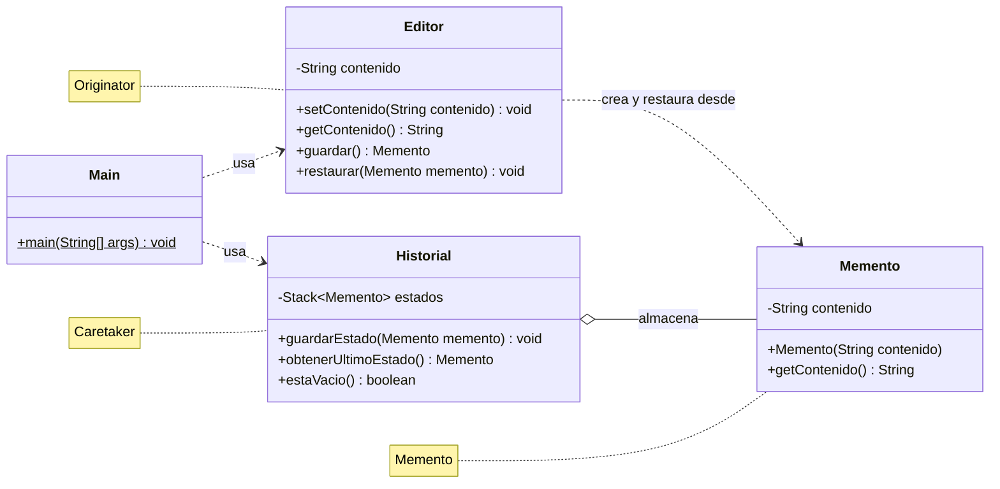

# Taller patrón memento

## Salida en pantalla

## Diagrama UML

```mermaid
classDiagram
    direction LR

    class Editor {
        -String contenido
        +setContenido(String contenido) void
        +getContenido() String
        +guardar() Memento
        +restaurar(Memento memento) void
    }

    class Memento {
        -String contenido
        +Memento(String contenido)
        +getContenido() String
    }

    class Historial {
        -Stack~Memento~ estados
        +guardarEstado(Memento memento) void
        +obtenerUltimoEstado() Memento
        +estaVacio() boolean
    }

    class Main {
        +main(String[] args)$ void
    }

    Editor ..> Memento : crea y restaura desde
    Historial o-- Memento : almacena
    Main ..> Editor : usa
    Main ..> Historial : usa

    note for Editor "Originator"
    note for Memento "Memento"
    note for Historial "Caretaker"
```
